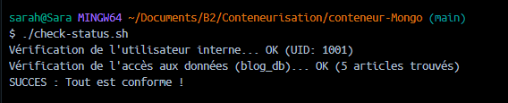
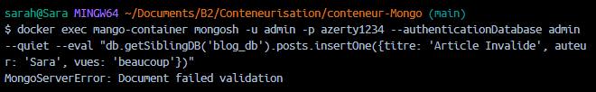
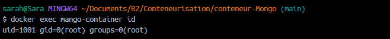
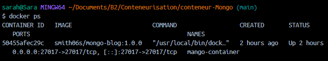
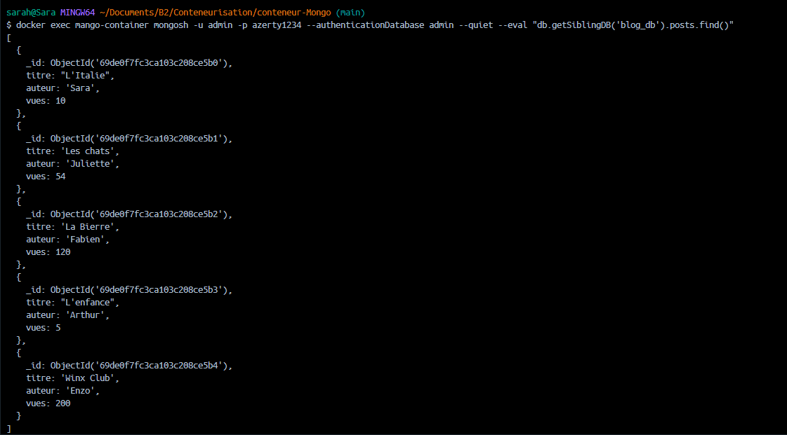

# Activité 1 - PROJET FIL ROUGE - B2 INFO CYBER

Image Docker MongoDB (ubi8-slim) incluant une base `blog_db` configurée avec un JSON.

**Lien Docker Hub :** [https://hub.docker.com/r/smith06s/mongo-blog](https://hub.docker.com/r/smith06s/mongo-blog)

## 1. Installation et Lancement

### Étape 1 : Configuration
Créez un fichier `.env` à partir du modèle `.env.example` en remplissant vos identifiants.

### Étape 2 : Construction de l'image
```bash
docker build -t smith06s/mongo-blog:1.0.0 .

### Étape 3 : Lancement
docker run -d --name mango-container --env-file .env -p 27017:27017 smith06s/mongo-blog:1.0.0

## 2. Vérification automatique

chmod +x check-status.sh
./check-status.sh

## 3. Livrables (Preuves de fonctionnement)

### Succès du script check-status.sh


### Validation de schéma (Erreur de sécurité)


### Utilisateur non-privilégié (UID 1001)


### État du conteneur (Docker PS)


### Données initialisées (find)
